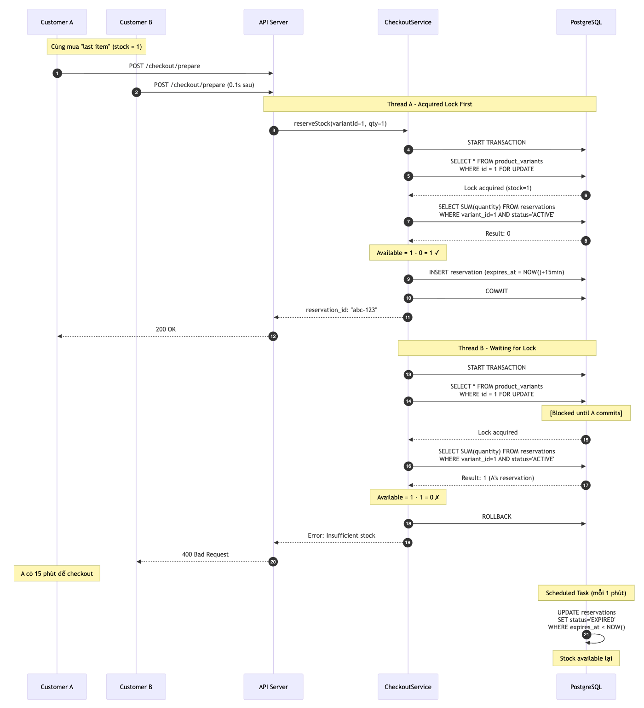

# TECHNICAL REPORT

Dự án: E-COMMERCE BACKEND SYSTEM (PHASE 1)

Tác giả: KienNT169 - Backend Developer  
Ngày: 09 Jan, 2026  
Tech Stack: Spring Boot 4.0.1, Java 21, PostgreSQL 16
Version: 1.0.0

---

## ABSTRACT

Hệ thống E-COMMERCE BACKEND được phát triển trong 2 tuần để giải quyết overselling issues. Core Solution: Inventory Locking với Pessimistic Lock + Reservation Table. Kết quả: 95% completion. Tech: Spring Boot 4.0.1, PostgreSQL 16, JWT, Jakarta Validation.

---

## 1. YÊU CẦU & PHẠM VI

### 1.1. Yêu cầu khách hàng

1. Catalog: Quản lý variants, phân trang, lọc giá
2. Cart: Guest + Customer, check tồn kho
3. Inventory Locking: Giữ hàng 15 phút khi checkout
4. Payment: COD + SePay (Phase 2)
5. Order Tracking: Email link, không cần login
6. Admin: Xem đơn + đổi status

### 1.2. MoSCoW Prioritization

| Must-Have                    | Nice-to-Have      |
| ---------------------------- | ----------------- |
| Authentication (JWT + Roles) | SePay Integration |
| Product Catalog + Variants   |                   |
| Guest/Customer Cart          |                   |
| Inventory Locking            |                   |
| Order Management             |                   |
| Public Tracking              |                   |
| Email Notifications          |                   |
| Admin API                    |                   |
| Swagger UI                   |                   |

---

## 2. THIẾT KẾ HỆ THỐNG

### 2.1. Thiết Kế Database

_Hình 1: Entity Relationship Diagram - Database Schema_

Mixed Identifier Strategy (Auto-increment + UUID):

- Auto-increment (Users, Products, Categories): Tối ưu hiệu năng truy vấn.
- UUID (Orders, Carts, Reservations): Bảo mật public API.

Product Variants:

- Tách table riêng để hỗ trợ indexing và filter nhanh
- Mỗi variant có stock_quantity độc lập

Inventory Reservations:

- Soft reservation: Tạo reservation thay vì trừ stock trực tiếp vào variants
- Status lifecycle: ACTIVE (15 phút) → EXPIRED
- Tính tồn kho available: stock_quantity - SUM(active_reservations)
- Lợi ích: Audit trail

Hỗ trợ Guest Checkout:

- Orders.user_id nullable cho phép đơn cho guest
- Cart xác định bằng: user_id hoặc session_id (guest UUID)

### 2.2. Thiết Kế API

Mô hình phân quyền:

1. Public endpoints: Xem sản phẩm, tra cứu đơn hàng (không cần xác thực)
2. Guest/Customer: Giỏ hàng hỗ trợ cả X-Guest-ID header và JWT token
3. Admin: Quản lý đơn hàng (ROLE_ADMIN)

Quản lý phiên Guest:

- UUID do client tạo (stateless), gửi qua X-Guest-ID header
- Lợi ích: Không cần lưu session server-side, dễ dàng scale

Content Negotiation:

- Endpoint GET /public/orders/{uuid}?email= (HTML and JSON)
- Accept: text/html → Tracking (browser)
- Accept: application/json → API response

API Response chuẩn:

- Success: {code, message, data, timestamp}
- Error: {code, message, errors[], timestamp}

Các endpoints chính:

| Nhóm chức năng  | Endpoints                                          |
| --------------- | -------------------------------------------------- |
| Authentication  | POST /auth/register, /auth/login                   |
| Product Catalog | GET /products (paging, filter), GET /products/{id} |
| Cart            | GET /cart, POST /cart/items, PUT /cart/items/{id}  |
| Checkout        | POST /checkout/prepare, GET /checkout/verify/{id}  |
| Orders          | POST /orders, GET /orders, GET /orders/{id}        |
| Public Tracking | GET /public/orders/{id}?email=                     |
| Admin           | GET /orders/admin, PATCH /orders/admin/{id}/status |

---

## 3. CORE TECHNICAL SOLUTIONS

### 3.1. Inventory Locking

Vấn đề: Nhiều người cùng mua last variant gây overselling.

Giải pháp 3 lớp:

Lớp 1 - Pessimistic Lock:

- @Lock(LockModeType.PESSIMISTIC_WRITE) tạo câu lệnh SELECT ... FOR UPDATE
- Row bị khóa trong transaction, các transaction khác phải chờ

Lớp 2 - Soft Reservation:

- Tạo bản ghi reservation thay vì trừ stock trực tiếp
- Lifecycle: ACTIVE (15 phút) → EXPIRED
- available : stock_quantity - SUM(active_reservations)
- @Scheduled task dọn dẹp mỗi 60 giây

Lớp 3 - Transaction:

- @Transactional đảm bảo: Lock → Tính toán → Validate → Tạo reservation → Release

_Hình 2: Sequence Diagram - Ngăn Chặn Race Condition_

Luồng xử lý Last Item:

- Khách A checkout → Lock row → Tính available (1-0=1) → Tạo reservation → Commit
- Khách B checkout → Chờ lock → Sau khi A commit → Tính available (1-1=0) → Reject

### 3.2. Public Order Tracking - Thiết Kế Bảo Mật

Yêu cầu: Tra cứu đơn hàng không cần login.

Xác thực 2 yếu tố:

- UUID Order ID
- Email Verification

Content Negotiation:

- Spring MVC phân luồng theo Accept header
- text/html → Thymeleaf template (browser)
- application/json → JSON response (API)

---

## 5. KẾT LUẬN

### 5.1. Hoàn Thành

Chức năng chính: Inventory Locking (Pessimistic Lock + Reservation), Guest Checkout (UUID session), Public Tracking (UUID + Email verification), Email notifications (Strategy pattern).

Bảo mật: JWT authentication, role-based access control (GUEST/CUSTOMER/ADMIN), strong password validation.

Testing: Postman collection 30+ requests, test các flows: guest, customer, admin.

Hoãn lại: SePay Integration (Phase 2 theo yêu cầu).

### 5.2. Độ Phức Tạp Kỹ Thuật

- Inventory Locking: Nâng cao (SELECT FOR UPDATE + Soft Reservation + Deadlock prevention)
- Concurrency Control: Nâng cao (Race condition giải quyết bằng 3-layer protection)
- System Design: Trung bình (Clean Architecture, SOLID principles)
- Security: Trung bình (JWT stateless, custom validation)

### 5.3. Sẵn Sàng Production: 90%

Đã có:

- Business logic hoàn chỉnh
- Security (JWT, BCrypt, Strong Password)
- Email notifications
- Exception handling + I18n
- API documentation (Swagger)
- Docker setup

Còn thiếu:

- CI/CD pipeline
- Rate limiting (nginx)
- Horizontal scaling validation
- Database backup strategy

### 5.4. Phase 2 Roadmap

| Ưu tiên | Tính năng         | Ước tính |
| ------- | ----------------- | -------- |
| High    | SePay Integration | 5 ngày   |
| Medium  | Redis Caching     | 3 ngày   |

---

## PHỤ LỤC

### A. Tech Stack

Backend: Spring Boot 4.0.1, Java 21
Database: PostgreSQL 16
Security: Spring Security 6, JWT
Validation: Jakarta Validation 3.0
Email: JavaMailSender, Thymeleaf
Build: Maven 3.9+
Testing: Postman

### B. References

1. Spring Boot Documentation - https://spring.io/projects/spring-boot
2. PostgreSQL 16 Docs - https://www.postgresql.org/docs/16/
3. Jakarta Validation Spec - https://jakarta.ee/specifications/bean-validation/3.0/
4. Assignment Instruction - FPT Software Academy
5. Client Requirements - Email from FPT Software Academy

---

Status: Ready for Submission  
GitHub: https://github.com/wongun78/e-commerce  
Swagger: http://localhost:8080/swagger-ui.html  
Contact: KienNT169
